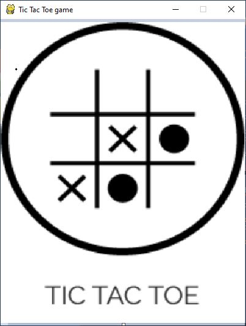
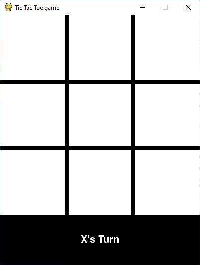

# TIC TAC TOE GAME

Pygame implementation of TicTacToe Game - A starter project to demonstrate the use of Classes and Objects in Python.
This was designed completely using pygame
Code inspired from Geeks for Geeks Tutorial
source link : https://www.geeksforgeeks.org/tic-tac-toe-gui-in-python-using-pygame/

